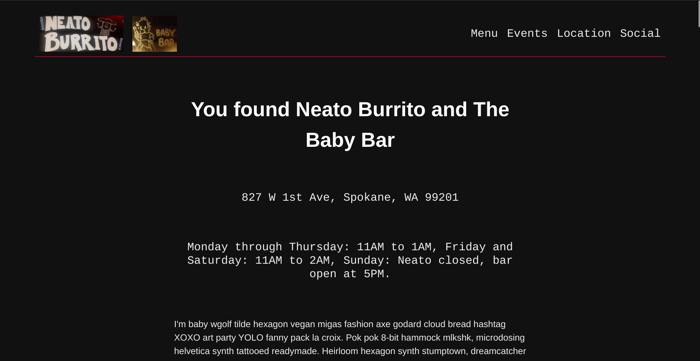

# Neato-Baby

Mock-up website for Neato Burrito and The Baby Bar

I wanted to build a modern, responsive site from a blank html page. Neato
Burrito has never had a website and the owners are feeling it may be time,
especially as a central location to get their menu out to the public. This
site's simple DIY structure and design fits the location's aesthetic. The site
is waiting before going live for a new logo design and final decisions from
their team on hosting, domain name, and exactly which photos and descriptions to
include.

**See this live:** https://bideinsilence.github.io/neato-baby/

## How it's made:
HTML, CSS, and a touch of Javascript

## Optimizations:
This site is built with valid and responsive html and css (including flexbox and
grid), and is also very lightweight and east to maintain. As a static site, it
can be easily and rapidly updated by a developer and moved quickly to a new
host.

The owners may possibly choose some day to incorporate online ordering or other
services.

## Lessons Learned:
It felt good to know that though I'm not much of a designer, I can build a
functional site without a template, and I learned that open and clear
communication with a client is invaluable. 

